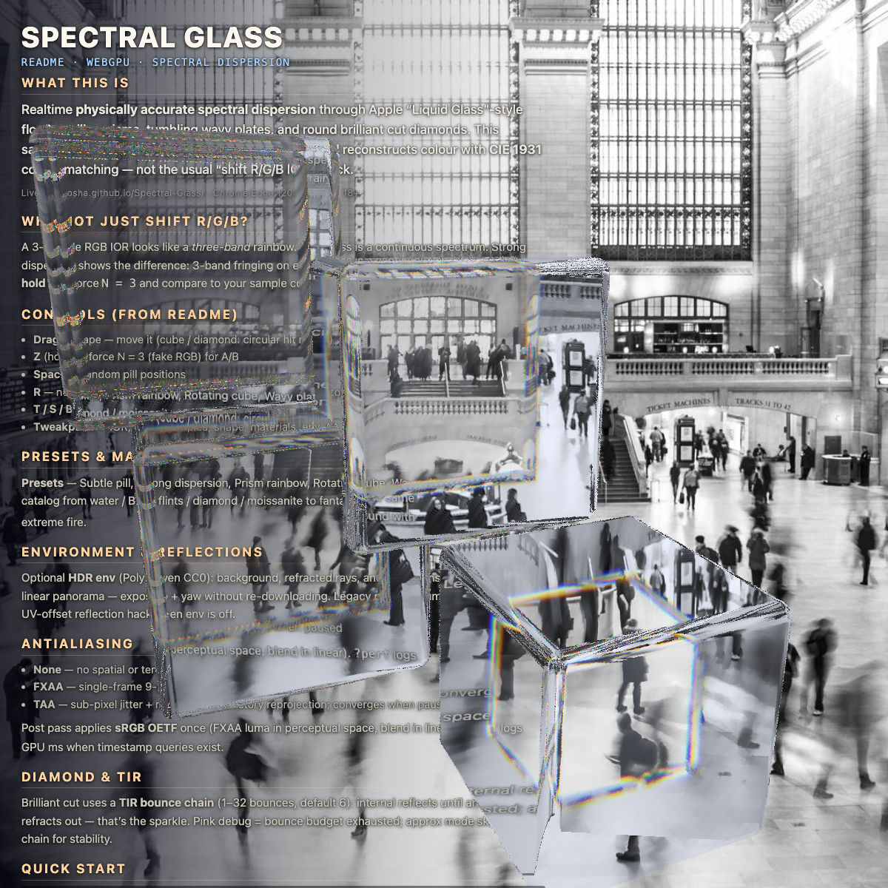
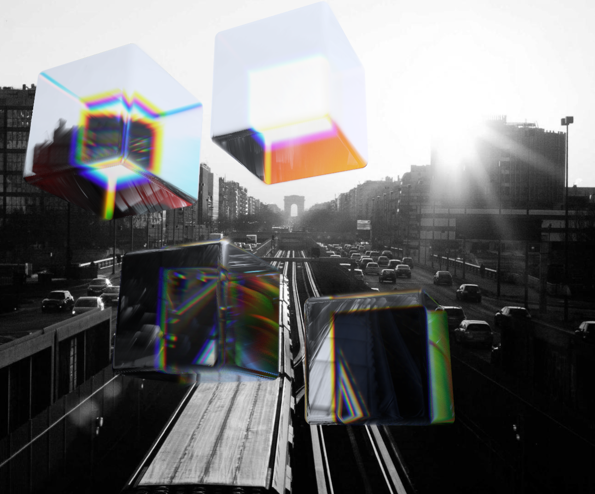

# Real Refraction

A realtime WebGPU demo of **physically accurate spectral dispersion** through
Apple "Liquid Glass"-style floating pills. Unlike the common "shift R/G/B IORs"
hack that most web implementations use (including Three.js's
`MeshPhysicalMaterial.dispersion`), this samples the full visible spectrum
per-wavelength and reconstructs the final color via CIE 1931 color matching
functions.



Above: four glass pills over a Picsum landscape. Subtle chromatic fringing is
visible at the rounded rim. Below: same scene with `V_d = 18` and refraction
strength `0.3`, where the per-wavelength offset is dramatic:



## Why not just shift R/G/B?

A 3-sample RGB IOR is visibly a *three-band* rainbow. Real glass is a continuous
spectrum. When dispersion is strong you can see the difference — the 3-sample
version looks like bad chromatic aberration, while the 8-sample spectral version
looks like a prism.

Press and hold **`Z`** in the demo to force `N = 3`. Release to go back to
`N = 8`. The quality difference is unmistakable.

## Quick start

```bash
bun install
bun run dev        # http://localhost:5173
bun run test       # Vitest on the math modules
bun run build      # tsc --noEmit + vite build
```

Requires a WebGPU-capable browser (Chrome / Edge 120+, Safari 18+).

## Controls

| Input | Action |
|---|---|
| Drag a pill | Move it around the canvas |
| **`Z`** (hold) | Force `N = 3` (fake RGB dispersion) for A/B comparison |
| **Space** | Shuffle pills to random positions |
| **`R`** | Reload a new random Picsum photo |
| Tweakpane | Live-adjust IOR, Abbe number, sample count, refraction strength, pill shape, temporal jitter, refraction mode |

## Technical approach

- **WebGPU + WGSL.** Single fullscreen fragment pass. Pills are rendered via
  sphere-traced 3D SDFs — no mesh data.
- **3D pill SDF.** Two-stage rounded extrusion: stadium silhouette from the top,
  rounded slab from the side, smooth 3D edges everywhere.
- **Cauchy + Abbe IOR.** Wavelength-dependent index via the glTF
  `KHR_materials_dispersion` formula.
- **Wyman-Sloan-Shirley CIE XYZ** (JCGT 2013) analytic approximation — no
  lookup tables.
- **Two-surface refraction.** Front hit via primary sphere-trace, back exit via
  per-wavelength inside-trace (Exact mode) or shared central-wavelength trace
  (Approx mode).
- **Per-wavelength sRGB weighting.** Each sampled photo pixel is weighted by
  `xyzToSrgb(cmf(λ))` — short-wavelength samples contribute to blue, long to
  red. This preserves photo color when refraction UVs coincide and produces
  real chromatic fringing where they diverge.
- **Temporal jitter.** Per-frame wavelength offset blended through a
  `rgba16float` ping-pong history texture (α = 0.2) — effective samples ~2-3× N.
- **Fresnel (Schlick) + cheap mirror reflection** for the glass look.
- **sRGB OETF** applied manually when the swapchain format is non-sRGB.

## Project structure

```
src/
├── main.ts                     Frame loop + glue
├── math/                       Pure math modules (unit-tested)
│   ├── cauchy.ts               Wavelength → IOR (glTF formulation)
│   ├── wyman.ts                Wyman CIE XYZ approximation
│   ├── srgb.ts                 XYZ → linear sRGB matrix + OETF
│   ├── sdfPill.ts              3D pill SDF (mirrors WGSL version)
│   ├── sdfPrism.ts             Triangular prism SDF (mirrors WGSL version)
│   └── sdfCube.ts              Rounded box / cube SDF (mirrors WGSL version)
├── persistence.ts              localStorage: validated load, debounced save, pagehide flush
├── photo.ts                    Picsum fetch → GPU texture (w/ gradient fallback)
├── pills.ts                    Pill state + shape-aware pointer drag
├── ui.ts                       Tweakpane bindings (shape selector, presets, materials)
├── webgpu/
│   ├── device.ts               Adapter + device + error handlers
│   ├── history.ts              Ping-pong history textures
│   ├── pipeline.ts             Render pipeline + pre-built bind groups
│   └── uniforms.ts             Typed uniform buffer writer
└── shaders/
    ├── fullscreen.wgsl         Fullscreen triangle vertex shader
    └── dispersion.wgsl         SDFs (pill/prism/cube) + spectral dispersion fragment

tests/                          Vitest unit tests for each math module
docs/
└── ARCHITECTURE.md             Frame path, uniform layout, SDF & tracing details
```

Math modules in `src/math/` are mirrored 1:1 by functions in
`src/shaders/dispersion.wgsl` — the 31 vitest tests act as the reference
implementation for the shader.

## Design

- [Architecture notes](docs/ARCHITECTURE.md) — module map, frame path, uniform layout, per-wavelength weighting rationale, TIR fallback, SDF details for pill / prism / cube

## References

1. Khronos. [**KHR_materials_dispersion**](https://github.com/KhronosGroup/glTF/blob/main/extensions/2.0/Khronos/KHR_materials_dispersion/README.md) — the Cauchy + Abbe formulation used here.
2. Wyman, Sloan, Shirley (2013). [**Simple Analytic Approximations to the CIE XYZ Color Matching Functions.**](https://jcgt.org/published/0002/02/01/) JCGT 2(2).
3. Wilkie et al. (2014). [**Hero Wavelength Spectral Sampling.**](https://jo.dreggn.org/home/2014_herowavelength.pdf) EGSR.
4. Peters (2025). [**Spectral Rendering, Part 2.**](https://momentsingraphics.de/SpectralRendering2Rendering.html)
5. Heckel. [**Refraction, dispersion, and other shader light effects.**](https://blog.maximeheckel.com/posts/refraction-dispersion-and-other-shader-light-effects/)

## Status

Tech demo / proof of technique. Not a library. No production website
integration. If you want to pull the spectral-refraction technique into your
own project, the interesting files are `src/shaders/dispersion.wgsl` and the
six math modules in `src/math/`.
